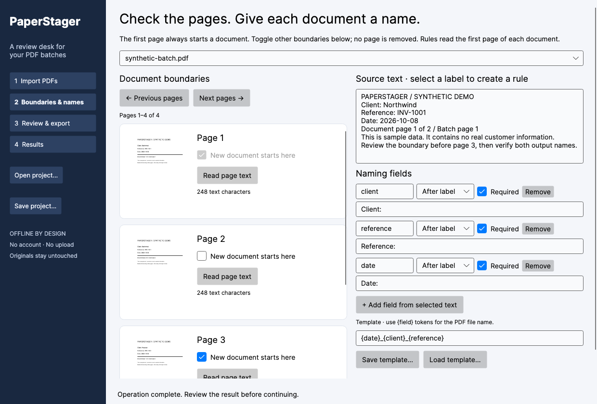

# PaperStager

**Review a scanned PDF batch, split it into documents, and give every file a verified name.**

PaperStager is an open-source C# desktop app for macOS, Windows and Linux. It starts with PDFs you already have. Actual page thumbnails help you mark document boundaries; multiple independent text rules suggest naming fields; a review desk catches missing fields, invalid names and duplicate paths before you approve an export.



## Get started

Download the portable package for your operating system from [Releases](https://github.com/rad1092/paperstager/releases). Extract it into an ordinary folder. On macOS open `PaperStager.app`, on Windows `PaperStager.exe`, and on Linux run `./PaperStager`. Packages include the .NET runtime. Linux needs an X11 desktop and `libx11-6 libice6 libsm6 libfontconfig1`; CI tests Ubuntu. Packages are **unsigned and not notarized**. There is no installer, automatic updater or security-settings bypass.

Use **Try a synthetic example** to inspect two fictitious documents, including a rotated page. No real invoices or personal data are included.

1. **Import PDFs** by dropping them into the window or choosing files.
2. **Boundaries & names:** check the first page of every document. Select text and add label/regex naming rules, or add rules directly. Use a template such as `{date}_{client}_{reference}`.
3. **Review & export:** correct extracted fields, skip documents with a reason, and refresh the proposed names. Check the approval box, then choose an output folder.
4. **Results:** the new batch folder contains ordinary PDF files and `manifest.json`, mapping original source hashes and page ranges to output hashes and names.

[한국어 빠른 시작](docs/QUICKSTART.ko.md) · [Privacy and offline policy](docs/PRIVACY.md) · [Limitations](docs/LIMITATIONS.md) · [Research and alternatives](docs/RESEARCH.md)

## What makes it useful

- Standalone, open-source workflow across three desktop operating systems.
- Searchable PDFs first: source text is reused instead of making another OCR guess.
- Multiple independent label or regex fields, reusable templates, editable values and Unicode names.
- Review and explicit approval; no background folder watchers or unattended export.
- Originals are only read. Existing output is never overwritten. A fresh batch folder is promoted only after staging completes.
- Failed or cancelled export leaves a clearly named recovery folder and progress journal where possible. Retry from the saved project after inspecting the journal.
- Save/open projects and templates as readable JSON. Approval is never saved.

This is not a new invention of split/name/review/commit: ScanRoute Local already serves that workflow on Windows. PaperStager focuses on open source, standalone cross-platform use and searchable-document field rules. It is not a scanner, OCR engine, document-management system or PDF annotation migration utility. To use image-only scans, first create a searchable PDF in [NAPS2](https://www.naps2.com/) or enter fields manually. No OCR or LLM executes inside this release.

## Build and verify

Install the official .NET 10 SDK, then:

```sh
dotnet restore PaperStager.slnx --locked-mode
dotnet build PaperStager.slnx -c Release --no-restore
dotnet test PaperStager.slnx -c Release --no-build
dotnet run --project src/PaperStager.App -- --demo
```

The core and GUI are C#. PDF rendering uses PDFium, text extraction uses PdfPig, and page copying uses PDFsharp. No commercial SDK or NAPS2 application code is embedded. Unsupported PDF structures (including annotations, forms, layers/actions and non-default page scaling) are rejected before page copying; see the explicit [support boundary](docs/LIMITATIONS.md#pdf-structure-safety-boundary). See [third-party notices](THIRD-PARTY-NOTICES.md).

The CI workflow builds and tests on macOS, Windows and Linux, creates self-contained archives, extracts them and runs the actual native window through import, thumbnails, project/template round trips and export **twice** to check restart. [Verification record](docs/VERIFICATION.md) distinguishes native checks from headless tests and untested limitations.

## Contributing

Keep changes focused. Use synthetic fixtures, retain originals, and test failure and cancellation paths. Read [AGENTS.md](AGENTS.md) and [the product specification](docs/SPEC.md). Report issues without attaching private PDFs; a reduced synthetic reproduction is ideal.

MIT licensed. Dependency licenses remain their respective licenses.
