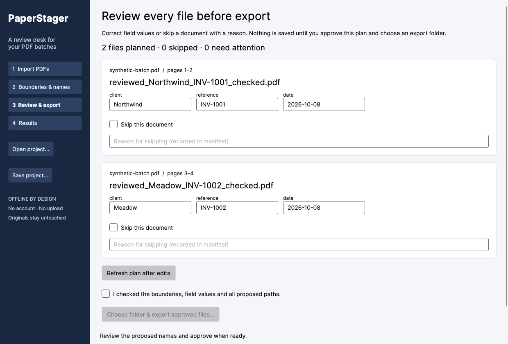
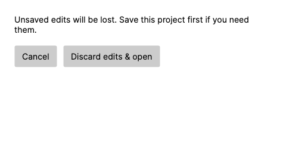

# Verification record

Verification uses synthetic documents only. It is not a guarantee for every PDF or filesystem.

## Local release validation — 2026-10-08

- macOS arm64, .NET SDK 10.0.401: Release build **0 warnings / 0 errors**; **104 Core tests + 10 desktop tests passed**, zero skipped.
- Core covers searchable/malformed/encrypted/rotated PDFs, Unicode and multiline naming, page boundaries, duplicate/path traversal names, stale approval, project/template round trips, source mutation before/during export, repeated export, cancellation, injected disk-write failure and recovery journals.
- PDF safety regressions reproduce raw PDFsharp hidden skipped-page content import through annotation destinations and `/UserUnit` loss. Import and export reject unsupported structures; supported plain-page output is inspected across all decoded objects for the skipped canary. Rotation, boxes and supported transparency group attributes are compared.
- Desktop tests cover immediate dirty state for pattern and all rule controls, Open/Close cancellation, back/repeat flows, safe cancelled/failed demo import, fresh approval after restoration, Unicode field edits and native PDFium rendering.
- Actual native-window `--qa` run passed: 4 pages, 8 thumbnail renders, two exports with 2 PDFs each, unchanged original SHA-256, saved/reopened projects and templates, review edits, close cancellation. [Machine-readable evidence](qa-native-macos.json).
- Release tooling: **6 tests passed**. Managed NuGet audit: 5 projects / 112 package references, 0 reported advisories. Credential-pattern scan: zero findings. Native embedded code is not comprehensively covered by NuGet's advisory database.

## Visible client-area captures

The images below were rendered by Avalonia `RenderTargetBitmap` from the **displayed native application window** during actual automation. They are not OS screenshots. PDF thumbnails came from native PDFium and actual synthetic PDFs.

External CUA app access failed to return twice and was aborted. It is not retried. **External window controls, native file/folder-picker mouse interaction and OS drag-and-drop remain manually unverified.** Automated project reopening is distinct from package process restart. No OS permission or security setting was changed.

## Exact source revision and multi-OS packages

[GitHub Actions](https://github.com/rad1092/paperstager/actions) builds/tests on macOS arm64, Windows x64 and Linux x64. Each job publishes a self-contained archive, verifies/extracts it, starts the actual native app, checks the import→render→review→export marker, closes and starts it again. macOS second launch uses the `.app` through LaunchServices. A 90-second app watchdog applies only to explicit synthetic QA/smoke modes.

The first run, `37713035957` at `596fec2`, failed during locked restore on all three OSes and is **not** a passing multi-OS result. The fix declares all three runtime identifiers and regenerates lock files. Read the successful run associated with the release's **exact commit**; release publication depends on all three jobs succeeding. Release metadata records `sourceCommit`, native architecture and file hashes. The release workflow downloads the published ZIPs again and verifies SHA256SUMS, sidecars and commit identity. The GitHub run and release notes provide the final machine-generated revision/result.

## Practical limits

Disk-write failure is injected; physical power failure, physical disk exhaustion, hostile filesystem races, hostile native-parser exploits and screen-reader parity are not established. Parsing/rendering can only be cancelled between native operations. Advanced PDF structure is conservatively rejected as documented in [Limitations](LIMITATIONS.md). Packages are unsigned and not notarized. Windows/Linux native package execution is CI automation, not a human desktop session.
